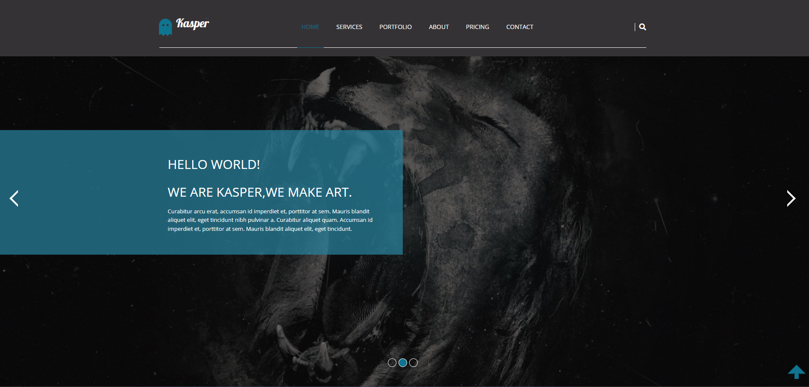
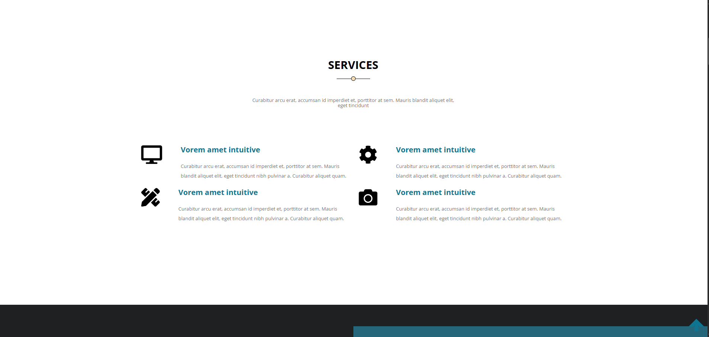
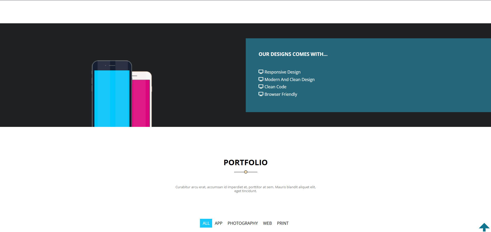
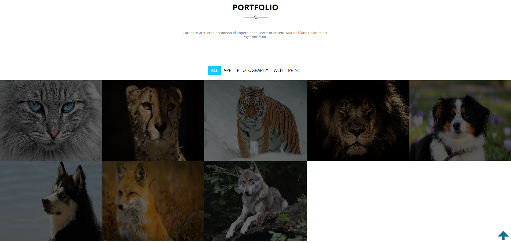
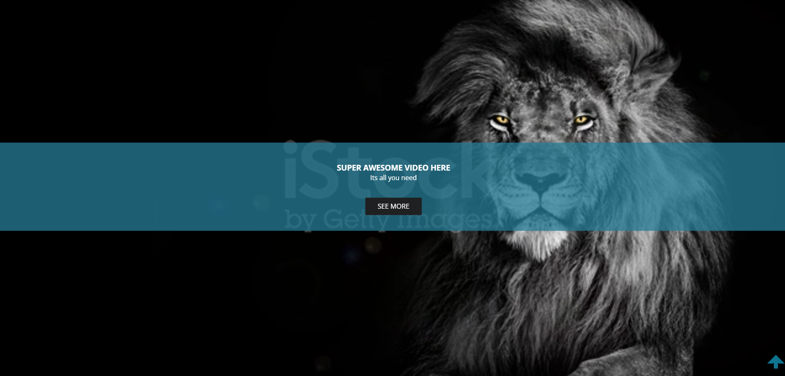
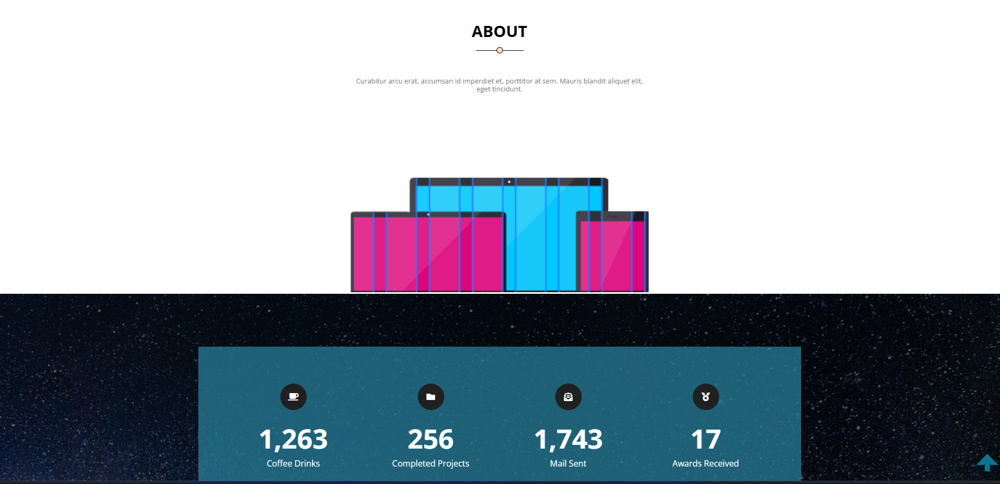
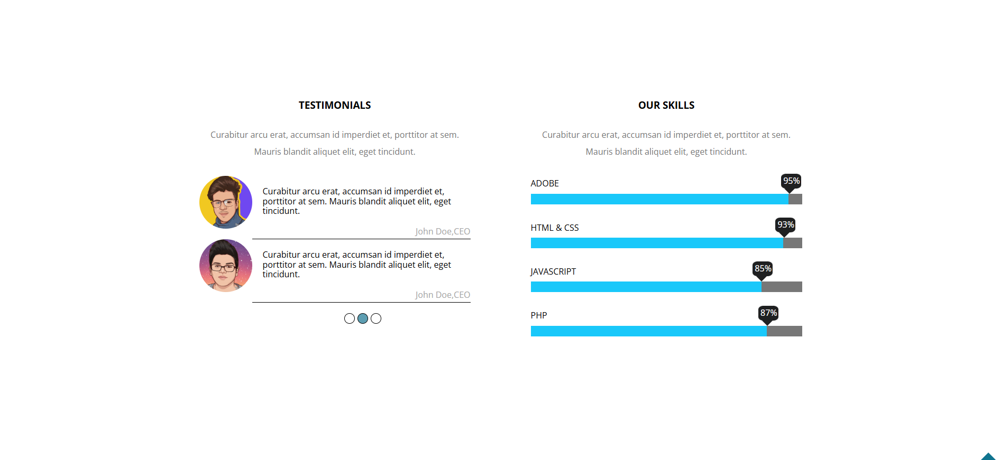
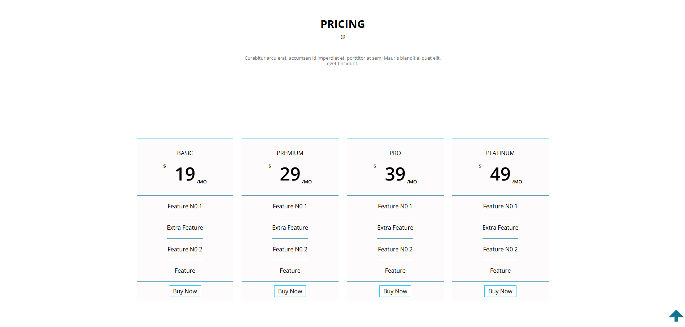
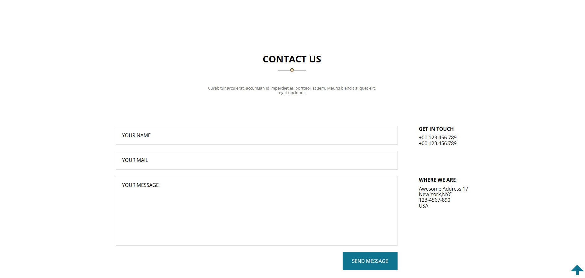
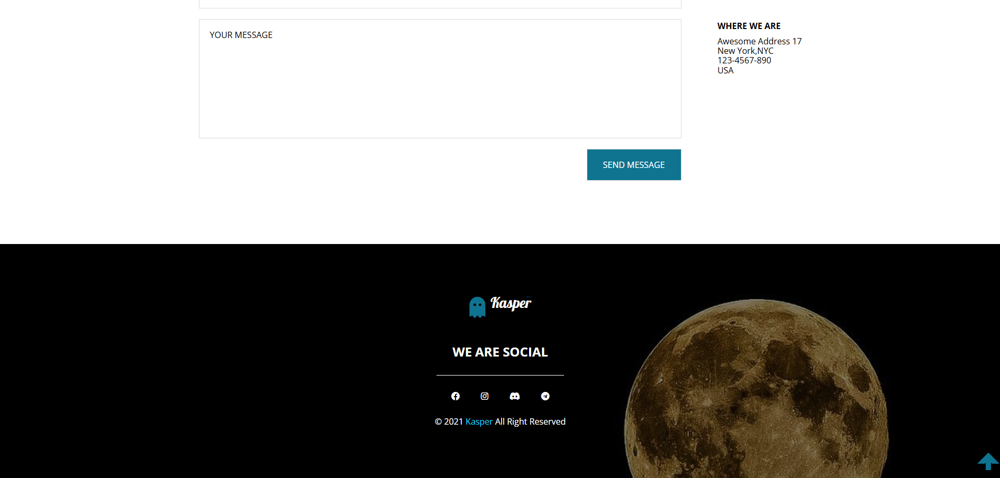

# Kasper — Creative Agency Website Template

> A rich, multi-section **single-page agency website** built with pure **HTML5** and **CSS3** — no JavaScript, no frameworks, no build tools. Features a full-viewport hero with teal overlay panel, CSS Grid portfolio gallery with hover zoom + caption slide-up, autoplay background video, animated skill progress bars with `data-progress` tooltips, 4-tier pricing cards, newsletter subscription form, and a CSS-only fixed scroll-to-top arrow.

---

## 📸 Preview

| Hero & Header | Services |
|---|---|
|  |  |

| Our Designs | Portfolio Gallery |
|---|---|
|  |  |

| Stats & Testimonials | Skills Progress Bars |
|---|---|
|  |  |

| Pricing Plans | Newsletter & Contact |
|---|---|
|  |  |

| Quote Section | Footer |
|---|---|
|  |  |

---

## ✨ Features

- **Pure HTML5 & CSS3** — Zero JavaScript, zero frameworks, zero build steps
- **CSS Custom Properties** — 4 global color tokens control the entire theme from `:root`
- **CSS Grid Layout** — Used in Services, Portfolio gallery, Pricing cards, and Testimonials
- **Full-Viewport Hero** — Background image + 60% dark overlay + left-side teal transparent text panel + CSS chevron arrows
- **CSS-Only Hamburger Menu** — Mobile nav toggled purely via `:hover` on the bars icon
- **Portfolio Image Gallery** — `matrix()` transform zoom on hover + caption slides up from `bottom: -100%` to `0`
- **Autoplay Background Video** — Muted looping MP4 embedded inside the Portfolio section
- **Portfolio Filter Tabs** — ALL / APP / PHOTOGRAPHY / WEB / PRINT filter menu (CSS active state)
- **Stats Counter Bar** — 4 animated stat items (Coffee Cups, Projects, Emails, Awards) over a parallax-style image
- **Testimonials Grid** — CSS Grid `auto 1fr` layout with circular avatar + quote + author attribution via `::after`
- **Skill Progress Bars** — CSS width bars with `data-progress` attribute read by `::before` pseudo-element for floating tooltip + `::after` downward arrow pointer
- **Quote Section** — Full-bleed dark photo with Font Awesome 5 open/close quote marks injected via CSS Unicode (`\f10d` / `\f10e`)
- **4-Tier Pricing Cards** — Basic / Premium / Pro / Platinum with `$` prefix and `/MO` suffix via `::before` / `::after`
- **Newsletter Form** — Mail icon via CSS `::before` FA5 Unicode, email input + submit button fused design over abstract background
- **Contact Form** — Name + Email + Textarea + Send button, alongside address info panel
- **Fixed Scroll-to-Top Arrow** — CSS-only `.back` anchor styled as a teal rotated border chevron, with `body::after` decorative backing element
- **Reusable `.min-heading` Component** — Centered `h2` with `::before` underline + `::after` diamond dot bullet used across all sections
- **Smooth Scroll** — Native `scroll-behavior: smooth` on all anchor links
- **Responsive Design** — Custom breakpoints at 768px, 992px, and 1200px via media queries
- **3 Google Fonts** — Open Sans (body), Pattaya (logo), Work Sans (available)
- **Font Awesome 5** — Self-hosted icons (brands, regular, solid — eot/ttf/woff/woff2/svg)
- **CSS Normalize** — Consistent cross-browser base styles

---

## 🗂️ Project Structure

```
tmplelet2/
│
├── tump2.html                  # Single-page HTML — all 8 sections
│
├── css/
│   ├── Kasper.css              # 🎨 Main stylesheet — all custom styles
│   ├── normalize.css           # Cross-browser CSS reset
│   └── all.min.css             # Font Awesome 5 (self-hosted)
│
├── img/                        # All images and assets
│   ├── img1.jpg                # Hero section background
│   ├── lion2.jpg               # Stats counter section background
│   ├── dark.jpg                # Quote section background
│   ├── abstract.png            # Newsletter section background
│   ├── footer.jpg              # Footer section background
│   ├── Tablets.PNG             # About section device mockup
│   ├── 1234 (2).png            # Our Designs phone mockup
│   ├── o.png                   # Testimonial avatar 1
│   ├── b.png                   # Testimonial avatar 2
│   ├── cat.jpg                 # Portfolio card — Cat
│   ├── Cheetah.jpg             # Portfolio card — Cheetah
│   ├── tiger.jpg               # Portfolio card — Tiger
│   ├── lion.jpg                # Portfolio card — Lion
│   ├── dog.jpg                 # Portfolio card — Dog
│   ├── husky.jpg               # Portfolio card — Husky
│   ├── fox.jpg                 # Portfolio card — Fox
│   └── wolf.jpg                # Portfolio card — Wolf
│
├── video/
│   └── Lion King.mp4           # Autoplay muted loop video (Portfolio section)
│
├── webfonts/                   # Font Awesome 5 self-hosted font files
│   ├── fa-brands-400.*         # Brand icons (eot, svg, ttf, woff, woff2)
│   ├── fa-regular-400.*        # Regular icons
│   └── fa-solid-900.*          # Solid icons
│
└── imageGithub/                # Preview screenshots for README
    └── 1.png … 10.png
```

---

## 🚀 Getting Started

No installation, no build step, no terminal needed.

### 1. Clone the repository

```bash
git clone https://github.com/your-username/kasper-template.git
cd kasper-template
```

### 2. Open in browser

Simply open `tump2.html` in any modern browser:

```bash
# macOS
open tump2.html

# Windows
start tump2.html

# Linux
xdg-open tump2.html
```

Or use the VS Code **Live Server** extension for auto-reload during development.

---

## 🎨 CSS Architecture

### CSS Custom Properties (`:root`)

All global design tokens live in one place in `Kasper.css`:

```css
:root {
  --main-color:       #0f748f;    /* Dark teal — service titles, active links, submit buttons */
  --sim-main-color:   #19c8fa;    /* Bright cyan — skill bars, pricing borders, subscribe btn */
  --transform-color:  #277e98bf;  /* Semi-transparent teal — hero panel, Our Designs panel */
  --blak-color:       #1f2021;    /* Near-black — Our Designs bg, stat icons, video CTA btn */
}
```

**To retheme the entire site**, change only these 4 variables — every section updates automatically.

### Color Palette

| Variable | Value | Used In |
|---|---|---|
| `--main-color` | `#0f748f` | Service titles, active nav links, contact submit btn, back arrow |
| `--sim-main-color` | `#19c8fa` | Skill progress bars, pricing plan borders, subscribe button |
| `--transform-color` | `#277e98bf` | Hero text panel, Our Designs text panel, portfolio "MORE" btn |
| `--blak-color` | `#1f2021` | Our Designs background, stat icon circles, video section CTA |
| `#353235` | Hardcoded | Header background |
| `#777` | Hardcoded | Body paragraph text color |
| `wheat` | Hardcoded | `.min-heading` diamond dot accent |

### Typography

| Font | Weight | Usage |
|---|---|---|
| Open Sans | 300–800 | All body text, paragraphs, nav links |
| Pattaya | 400 | Logo word "Kasper" only |
| Work Sans | 200–800 | Available, imported via Google Fonts |

### Responsive Breakpoints

```css
@media (max-width: 768px)  { /* Mobile: hamburger, stacked grid, hide mockup images */ }
@media (min-width: 768px)  { .container { width: 750px; }  /* Pricing: 2-col grid */ }
@media (min-width: 992px)  { .container { width: 970px; }  /* Pricing: 4-col grid */ }
@media (min-width: 1200px) { .container { width: 1170px; } }
```

---

## 🖋️ HTML Structure (`tump2.html`)

The page is a single file with 9 semantic sections, all linked from the navbar:

```html
<a class="back">          <!-- Fixed CSS-only scroll-to-top arrow (bottom-right) -->
<header>                  <!-- Logo + CSS hamburger menu + search icon -->
<section.landing>         <!-- Full-viewport hero: image + overlay + teal text panel + bullets -->
<section.services>        <!-- 2-col CSS Grid: FA icon + title + description rows -->
<section.our-disigns>     <!-- Dark split: phone mockup left + feature list right -->
<section.portflio>        <!-- Filter tabs + CSS Grid gallery + video section -->
<section.about>           <!-- Tablet mockup + stats bar + testimonials + skills + quote -->
<section.pricing>         <!-- 4-tier pricing cards + newsletter form -->
<section.Contact>         <!-- Contact form + address info -->
<footer>                  <!-- Background image + logo + social links + copyright -->
```

---

## 📄 Sections Overview

| Section | ID | Description |
|---|---|---|
| **Header** | — | Dark `#353235` bar — ghost icon logo + "Kasper" in Pattaya font, CSS hover hamburger menu on mobile, search icon with left border divider, white `::after` underline rule |
| **Landing / Hero** | `#` | Full `100vh`, `img1.jpg` cover, 60% black overlay, left 50% teal semi-transparent text panel, CSS `::before`/`::after` chevron arrows on sides, 3 slide bullet dots |
| **Services** | `#services` | `.min-heading` component + CSS Grid 2-col, each service row: large FA icon left + teal `h3` + body text right; stacks to column on mobile |
| **Our Designs** | — | Dark `#1f2021` 400px split — phone mockup image left (hidden on mobile), teal panel right listing 4 design features |
| **Portfolio** | `#portflio` | Filter tab menu (ALL/APP/PHOTOGRAPHY/WEB/PRINT), CSS Grid `auto-fill minmax(362px)` gallery of 8 wildlife photos, each with `matrix()` zoom + caption slide-up on hover, "MORE" floating button, autoplay muted loop video with overlay text |
| **About** | `#about` | Tablet device mockup, stats counter row (1,263 Coffees / 256 Projects / 1,743 Emails / 17 Awards) over `lion2.jpg`, Testimonials grid, skill progress bars, quote over `dark.jpg` |
| **Pricing** | `#pricing` | 4 plans (Basic $19 / Premium $29 / Pro $39 / Platinum $49) with `$` and `/MO` via pseudo-elements, newsletter email form over `abstract.png` with FA5 mail icon via CSS |
| **Contact** | `#Contact` | Full contact form (Name, Email, Textarea, Send Message button) + address sidebar (phone, location); reverses to column on mobile |
| **Footer** | — | `footer.jpg` background, 48% overlay, logo, "WE ARE SOCIAL" heading, social icons (Facebook, Instagram, Discord, Telegram), copyright with cyan brand name |

---

## ⚡ CSS Techniques Highlights

### `.min-heading` Reusable Section Header
```css
/* Centered underline + diamond dot bullet — used in every section */
.min-heading h2::before {
  content: " ";
  width: 90px; height: 1px;
  background-color: black;
  bottom: 0; left: 50%;
  transform: translateX(-50%);
}
.min-heading h2::after {
  content: " ";
  width: 10px; height: 10px;
  border-radius: 50%;
  background: wheat;
  bottom: -5px; left: 50%;
  transform: translateX(-50%);
}
```

### Portfolio Image Hover — Zoom + Caption Slide-Up
```css
/* Image zooms with CSS matrix() transform */
.Awesome-Image:hover img {
  transition: 0.5s;
  transform: matrix(1.2, 0, 0.2, 1.2, 0, 0);
}
/* Caption slides up from off-screen bottom */
.Awesome-Image .caption { bottom: -100%; }
.Awesome-Image:hover .caption {
  transition: 0.5s;
  bottom: 0;
}
```

### Skill Progress Bars — `data-progress` Tooltip
```css
/* Tooltip reads the data-progress attribute from HTML */
.our-skills span::before {
  content: attr(data-progress); /* e.g. "95%" */
  background-color: #1f2021;
  color: white;
  position: absolute;
  top: -190%;
  right: -5%;
  border-radius: 25%;
}
/* Downward arrow pointer below the tooltip */
.our-skills span::after {
  content: "";
  border-color: #1f2021 transparent transparent transparent;
  border: 10px solid;
  position: absolute;
  top: 0%; right: -2.5%;
  transform: translate(0, -50%);
}
```

Usage in HTML:
```html
<span style="width: 95%;" data-progress="95%"></span>
```

### Quote Section — FA5 Unicode via CSS
```css
.about .Quote q::before {
  font-family: "font Awesome 5 Free";
  content: "\f10d";  /* fa-quote-left */
  font-weight: 900;
}
.about .Quote q::after {
  font-family: "font Awesome 5 Free";
  content: "\f10e";  /* fa-quote-right */
  font-weight: 900;
}
```

### Newsletter Form — Mail Icon via CSS
```css
.pricing .email form::before {
  font-family: "font Awesome 5 Free";
  content: "\f0e0";  /* fa-envelope */
  font-weight: 900;
  position: absolute;
  left: 25px; top: 50%;
  transform: translateY(-50%);
}
```

### Pricing — `$` Prefix + `/MO` Suffix via Pseudo-elements
```css
.pricing .category .col .head span::before { content: "$"; font-size: 13px; top: 0; left: 0; }
.pricing .category .col .head span::after  { content: "/MO"; font-size: 13px; bottom: 0; right: 0; }
```

### CSS-Only Scroll-to-Top Arrow
```css
/* Rotated border creates the upward chevron */
.back {
  position: fixed;
  right: 15px; bottom: 15px;
  border: 10px solid;
  border-color: var(--main-color) var(--main-color) transparent transparent;
  transform: rotate(315deg);
}
/* Decorative backing block */
body::after {
  background: var(--main-color);
  position: fixed;
  right: 25px; bottom: 18px;
  width: 10px; height: 20px;
}
```

### CSS-Only Mobile Hamburger Menu
```css
/* Bars icon hidden on desktop, shown on mobile */
.tooggle-menu { display: none; }
@media (max-width: 768px) { .tooggle-menu { display: flex; } }

/* Dropdown appears on hover — no JS needed */
.tooggle-menu:hover + ul {
  display: flex;
  flex-direction: column;
  position: absolute;
  background: #353235f0;
  width: 100%; top: 100%; left: 0;
}
```

---

## 🛠️ Built With

| Technology | Version | Purpose |
|---|---|---|
| HTML5 | — | Semantic single-page structure |
| CSS3 | — | All layout, animation, theming, and interactions |
| [Open Sans](https://fonts.google.com/specimen/Open+Sans) | 300–800 | Primary body typeface |
| [Pattaya](https://fonts.google.com/specimen/Pattaya) | 400 | Logo display font |
| [Work Sans](https://fonts.google.com/specimen/Work+Sans) | 200–800 | Imported, available for headings |
| [Font Awesome](https://fontawesome.com/) | 5.x | Self-hosted icons (service icons, social links, quote marks) |
| [normalize.css](https://necolas.github.io/normalize.css/) | — | Cross-browser CSS reset |

---

## 🌐 Browser Support

No build tools or transpilation — relies entirely on native browser CSS features:

| Feature | Support |
|---|---|
| CSS Custom Properties | ✅ All modern browsers |
| CSS Grid | ✅ All modern browsers |
| `scroll-behavior: smooth` | ✅ Chrome, Firefox, Edge, Safari 15.4+ |
| CSS `matrix()` transform | ✅ All modern browsers |
| `content: attr(data-*)` | ✅ All modern browsers |
| `<video autoplay muted loop>` | ✅ All modern browsers |
| IE | ❌ Not supported (CSS Grid + Custom Properties) |

---

## 📝 Customization Guide

**Change the brand colors:** Edit the 4 tokens in `Kasper.css`:
```css
:root {
  --main-color:      #e74c3c;   /* swap teal for red */
  --sim-main-color:  #ff6b6b;   /* swap cyan for light red */
  --transform-color: #c0392b99; /* semi-transparent version */
  --blak-color:      #1a1a2e;   /* swap near-black for dark navy */
}
```

**Add a portfolio card:**
```html
<div class="Awesome-Image">
  
  <div class="caption">
    <h3>Project Title</h3>
    <p>Category</p>
  </div>
</div>
```

**Add a skill bar:**
```html
<li>
  <p>YOUR SKILL</p>
  <div>
    <span style="width: 80%;" data-progress="80%"></span>
  </div>
</li>
```

**Add a pricing plan:**
```html
<div class="col">
  <div class="head">
    <h3>ENTERPRISE</h3>
    <span>99</span>
  </div>
  <ul>
    <li>Feature 1</li>
    <li>Feature 2</li>
  </ul>
  <div class="foot"><a href="#">Buy Now</a></div>
</div>
```

**Change the hero background:**
```css
.landing {
  background-image: url(../img/your-hero.jpg);
}
```

**Add a social link in the footer:**
```html
<li><a href="https://twitter.com/yourhandle"><i class="fab fa-twitter"></i></a></li>
```

---

## 📜 License

This project is open-source and available under the [MIT License](LICENSE).

The **Font Awesome 5** icons are licensed under [CC BY 4.0](https://creativecommons.org/licenses/by/4.0/) (icons) and [SIL OFL 1.1](https://scripts.sil.org/OFL) (fonts).

---

## 🙋 Author

**Alilo Alaedine**
- GitHub: [@BoutefahaAlaeddine](https://github.com/BoutefahaAlaeddine)

---

> ⭐ If you found this project useful, consider giving it a star on GitHub!
